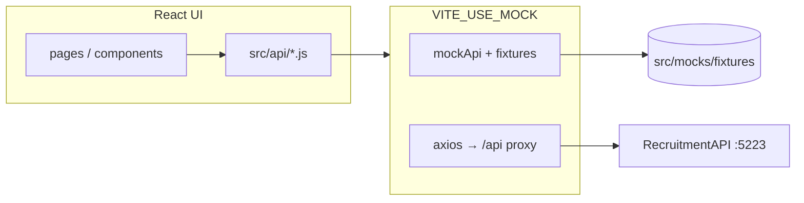

# V0 / Vercel Frontend — API Mocking Guide

Deploy and iterate on the Talentify UI **without PostgreSQL or .NET**, using JSON fixtures that match the **real API shape** (camelCase, same fields, same `axios` response wrapping). Switch back to the live API with one environment flag.

---

## Goal

| Phase | What runs |
|-------|-----------|
| **V0 + Vercel** | Static/Next UI + mock `/api/*` (JSON fixtures + in-memory mutations) |
| **Local dev (full stack)** | Vite → proxy `/api` → `RecruitmentAPI` + PostgreSQL |

UI code should not care which backend is active — only the **API adapter** changes.

---

## Architecture



**Rule:** Pages import `getVacantes` from `vacantesApi.js` — never `fetch` directly. Mocking lives behind that boundary.

---

## Step 1 — Capture “golden” fixtures from the real API

Run the backend once locally (`dotnet run` + seeded DB), then snapshot responses.

### Option A — Browser / Swagger

1. Open `http://localhost:5223/swagger`
2. Call `GET /api/vacantes`, `GET /api/postulaciones`, `POST /api/auth/login`, etc.
3. Copy response bodies into JSON files.

### Option B — Script (recommended)

```bash
# From recruitment-frontend/
mkdir -p src/mocks/fixtures

# Public
curl -s http://localhost:5223/api/vacantes -o src/mocks/fixtures/vacantes.list.json
curl -s http://localhost:5223/api/postulaciones -o src/mocks/fixtures/postulaciones.list.json

# Auth (save only shape — rotate tokens in git)
curl -s -X POST http://localhost:5223/api/auth/login \
  -H "Content-Type: application/json" \
  -d '{"email":"admin@example.com","password":"Admin123!"}' \
  -o src/mocks/fixtures/auth.login.admin.json
```

### Option C — Export from PostgreSQL

Use only if you need bulk realistic rows; still **normalize to API DTO shape** (not raw table columns). Prefer API snapshots so nested fields (`requisitos`, `permissions`) match what the frontend already parses.

### Fixture folder layout

```
src/mocks/
  fixtures/
    vacantes.list.json
    vacantes.by-id.{uuid}.json
    postulaciones.list.json
    postulaciones.by-vacante.{uuid}.json
    screening-questions.{uuid}.json
    auth.login.admin.json
    auth.login.recruiter.json
    auth.login.candidate.json
    analytics.pipeline.json
    analytics.time-to-hire.json
    platform.overview.json
    ...
  mockStore.js          # in-memory DB for PATCH/POST/DELETE
  mockDelay.js          # optional latency
  index.js              # route mock handlers
```

**Git:** Add `src/mocks/fixtures/*.local.json` to `.gitignore` if fixtures contain real emails; commit **sanitized** `*.example.json` for V0.

---

## Step 2 — Match exact JSON shapes (camelCase)

ASP.NET Core serializes DTOs as **camelCase** by default. Your frontend already expects:

### `GET /api/vacantes` → array item (`VacanteResponseDTO`)

```json
{
  "id": "a1b2c3d4-e5f6-7890-abcd-ef1234567890",
  "titulo": "Desarrollador React Senior",
  "descripcion": "Buscamos experiencia en React 19, Vite y Tailwind…",
  "ubicacion": "San Salvador",
  "tipoContrato": "Tiempo completo",
  "salarioMin": 1200,
  "salarioMax": 2200,
  "estaActiva": true,
  "umbralPuntaje": 60,
  "screeningActivo": true,
  "createdAt": "2026-05-28T14:30:00Z",
  "updatedAt": "2026-05-30T09:00:00Z",
  "requisitos": ["React", "TypeScript", "PostgreSQL"],
  "postulacionesCount": 4
}
```

`mapVacante()` in `src/utils/vacanteHelpers.js` reads: `id`, `titulo`, `ubicacion`, `tipoContrato`, `salarioMin`, `salarioMax`, `createdAt`, `descripcion`, `requisitos`, `estaActiva`.

### `GET /api/postulaciones` → array item (`PostulacionResponseDTO`)

```json
{
  "id": "b2c3d4e5-f6a7-8901-bcde-f12345678901",
  "nombreCandidato": "María López",
  "email": "maria@example.com",
  "telefono": "+503 7000-0000",
  "cvFileName": "cv-maria.pdf",
  "vacanteId": "a1b2c3d4-e5f6-7890-abcd-ef1234567890",
  "vacanteTitulo": "Desarrollador React Senior",
  "estado": 0,
  "notasInternas": null,
  "puntaje": 78.5,
  "puntajeDetalle": "{\"requisitos\":45.0,\"ubicacion\":25.0,\"completeness\":8.5}",
  "createdAt": "2026-06-01T10:00:00Z",
  "updatedAt": "2026-06-01T10:00:00Z",
  "emailStatus": "pending",
  "emailScheduledFor": "2026-06-01T10:05:00Z",
  "emailSentAt": null,
  "emailTypeToSend": "confirmation",
  "emailRetryCount": 0
}
```

**`estado` enum (number):** `-1` Rechazado, `0` Nuevo, `1` Entrevista, `2` Prueba Técnica, `3` Oferta.

**`puntajeDetalle`:** JSON **string**, not object — parse with `JSON.parse` only when needed.

### `POST /api/auth/login` → body (`AuthResponseDTO`)

Flat object (not nested `user`):

```json
{
  "token": "mock-jwt-admin",
  "nombre": "Admin",
  "apellido": "Talentify",
  "email": "admin@talentifysv.com",
  "rol": "Administrador",
  "permissions": ["jobs:create", "jobs:read_all", "applications:read", "applications:update_status"],
  "companyId": null
}
```

`AuthContext.login(res.data)` destructures `{ token, ...userData }` and stores `tb_token` / `tb_user` in `localStorage` (`STORAGE_KEYS` in `src/constants.js`).

### `GET /api/vacantes/{id}/screening-questions`

```json
[
  {
    "id": "c3d4e5f6-a7b8-9012-cdef-123456789012",
    "vacanteId": "a1b2c3d4-e5f6-7890-abcd-ef1234567890",
    "questionText": "¿Tienes experiencia liderando equipos?",
    "questionType": "boolean",
    "options": null,
    "maxScore": 10,
    "required": true,
    "orden": 0
  },
  {
    "id": "d4e5f6a7-b8c9-0123-def0-234567890123",
    "vacanteId": "a1b2c3d4-e5f6-7890-abcd-ef1234567890",
    "questionText": "Años de experiencia con React",
    "questionType": "scale_1_5",
    "options": null,
    "maxScore": 10,
    "required": true,
    "orden": 1
  }
]
```

For `multiple_choice`, `options` is a **JSON string**: `"[\"Sí\",\"No\",\"Tal vez\"]"`.

---

## Step 3 — API adapter with an environment toggle

Keep `src/api/axiosInstance.js` for production. Add a mock path used when mocks are enabled.

### Environment variables

| Variable | V0 / Vercel mock | Local full stack |
|----------|------------------|------------------|
| `VITE_USE_MOCK` | `true` | `false` or unset |
| `VITE_API_URL` | unset (or mock base) | unset (Vite proxy) or production API URL |

`.env.mock` (committed):

```env
VITE_USE_MOCK=true
```

`.env.local` (not committed, real API):

```env
VITE_USE_MOCK=false
```

### Pattern: mock-aware API module

```js
// src/api/vacantesApi.js
import API from './axiosInstance';
import { isMock } from '../mocks/config';
import * as mock from '../mocks/handlers/vacantes';

export const getVacantes = () =>
  isMock ? mock.getVacantes() : API.get('/vacantes');

export const getVacanteById = (id) =>
  isMock ? mock.getVacanteById(id) : API.get(`/vacantes/${id}`);
```

```js
// src/mocks/config.js
export const isMock = import.meta.env.VITE_USE_MOCK === 'true';
```

### Mock handler returns axios-shaped responses

```js
// src/mocks/axiosShape.js
export function mockResponse(data, status = 200) {
  return Promise.resolve({ data, status, statusText: 'OK', headers: {}, config: {} });
}
```

```js
// src/mocks/handlers/vacantes.js
import vacantesList from '../fixtures/vacantes.list.json';
import { mockResponse } from '../axiosShape';
import { getStore, setStore } from '../mockStore';

export function getVacantes() {
  const data = getStore('vacantes') ?? vacantesList;
  return mockResponse(data);
}
```

Pages keep using `const res = await getVacantes(); const jobs = res.data.map(mapVacante);` — unchanged.

---

## Step 4 — In-memory store for interactive UI

Read-only fixtures are enough for the **landing**. Kanban/admin need **mutations**:

| Action | Mock behavior |
|--------|----------------|
| `PATCH .../estado` | Update `estado` in `mockStore.postulaciones` |
| `PATCH .../notas` | Update `notasInternas` |
| `POST .../postulaciones` | Append row, return `201` |
| `POST auth/login` | Match email → return fixture user + fake JWT |
| `DELETE vacante` | Remove from store |
| CV upload | Accept `FormData`, set `cvFileName: 'mock.pdf'`, no file IO |
| `GET .../cv` | Return static PDF from `public/mock/cv-sample.pdf` |

```js
// src/mocks/mockStore.js — hydrate once from fixtures
let state = null;

export function initMockStore() {
  if (state) return state;
  state = {
    vacantes: structuredClone(vacantesList),
    postulaciones: structuredClone(postulacionesList),
  };
  return state;
}

export function getStore(key) {
  return initMockStore()[key];
}
```

Persist to `sessionStorage` optional so refresh keeps Kanban moves during a V0 demo.

---

## Step 5 — Mock users (login without backend)

| Email | Password | `rol` | Use for |
|-------|----------|-------|---------|
| `admin@talentifysv.com` | any | `Administrador` | Admin, Kanban, vacantes CRUD |
| `recruiter@talentifysv.com` | any | `Manager` | Analytics, read_all |
| `candidato@example.com` | any | `Estudiante` | `/dashboard` candidate view |

```js
export function login({ email, password }) {
  const users = {
    'admin@talentifysv.com': () => import('../fixtures/auth.login.admin.json'),
    // ...
  };
  const loader = users[email.toLowerCase()];
  if (!loader) return Promise.reject({ response: { status: 401, data: { message: 'Credenciales inválidas' } } });
  return loader().then((m) => mockResponse(m.default ?? m));
}
```

Use **fake JWT** strings; mock mode should not validate crypto.

---

## Step 6 — V0 by Vercel specifics

V0 usually generates **Next.js** (App Router). Talentify today is **Vite + React Router**. Two paths:

### Path A — Rebuild UI in V0 (Next.js on Vercel)

1. Paste this doc + **fixture JSON** into the V0 prompt (“use exactly these field names”).
2. Implement **Route Handlers** mirroring .NET routes:

```
app/api/vacantes/route.ts          → GET list
app/api/vacantes/[id]/route.ts     → GET one
app/api/postulaciones/route.ts     → GET / POST
app/api/auth/login/route.ts        → POST
```

Each handler `import fixtures from '@/mocks/fixtures/...'` and returns `Response.json(data)`.

3. For mutations, keep a module-level `Map` (same idea as `mockStore.js`).
4. Deploy to Vercel — no database env vars required.
5. When merging back to Vite: copy `fixtures/` + handler logic into `src/mocks/`.

### Path B — Keep Vite SPA on Vercel

1. `VITE_USE_MOCK=true` at build time.
2. Deploy `dist/` as static site.
3. All data from bundled JSON + `mockStore` (no serverless).
4. Fastest for **landing-only** redesign; Kanban still works if store is implemented.

### Path C — MSW (either stack)

[Mock Service Worker](https://mswjs.io/) intercepts `/api/*` in the browser — same fixtures, works in V0 preview and Vite without Next route handlers. Enable only when `VITE_USE_MOCK=true`.

---

## Step 7 — Special cases

### Multipart application (`createPostulacionStructured`)

Backend expects `FormData` with file + JSON strings (`skillsJson`, `availabilityJson`, `screeningResponsesJson`). Mock:

```js
export function createPostulacionStructured(formData) {
  // read vacanteId from formData, append fake postulacion to store
  return mockResponse({ id: crypto.randomUUID(), /* ... */ }, 201);
}
```

### CV preview

- Put `public/mock/cv-sample.pdf`
- `fetchCvBlob` in mock: `fetch('/mock/cv-sample.pdf').then(r => r.blob())`
- `getCvUrl` can stay `/api/postulaciones/{id}/cv` if MSW intercepts, or return `/mock/cv-sample.pdf` in mock mode

### Polling (30s)

Landing and Kanban poll live endpoints — mocks should return the **same array reference or updated store** so UI refreshes realistically.

### Permissions / `<Can>`

Seed `permissions[]` on mock login fixtures to match `src/lib/permissions.js` or real RBAC names (`jobs:create`, `applications:read_all`, etc.).

---

## Step 8 — Switch back to real database (local)

1. Set `VITE_USE_MOCK=false` in `.env.local` (or remove it).
2. Do **not** set `VITE_API_URL` for LAN dev — Vite proxy in `vite.config.js` forwards `/api` → `http://localhost:5223`.
3. Start PostgreSQL + `dotnet run` in `RecruitmentAPI`.
4. `npm run dev` in `recruitment-frontend`.
5. Clear mock session if needed: remove `tb_token` / `tb_user` from localStorage.
6. Real login against seeded admin user.

No UI changes if all calls go through `src/api/*`.

---

## V0 prompt template (copy-paste)

```
Build a Spanish ATS job board UI for El Salvador.

Use these API contracts exactly (camelCase JSON):
- GET /api/vacantes → array of vacantes (see fixture below)
- GET /api/postulaciones → array with estado -1..3, puntaje, emailStatus fields
- POST /api/auth/login → flat { token, nombre, apellido, email, rol, permissions, companyId }

Do not invent field names. Use Tailwind, mobile-first (768px layout breakpoint).

Mock all API routes with static JSON from /mocks/fixtures — no database.

[Paste vacantes.list.json and auth.login.admin.json here]
```

---

## Checklist

- [ ] Snapshot fixtures from real API (not guessed)
- [ ] All `src/api/*.js` routes have mock handlers
- [ ] Mock returns `{ data }` like axios
- [ ] `puntajeDetalle` and `options` stay JSON **strings** where backend sends strings
- [ ] `estado` is numeric
- [ ] Auth response is flat with `token` at top level
- [ ] Mock login users for admin / recruiter / candidate
- [ ] Kanban PATCH updates in-memory store
- [ ] `VITE_USE_MOCK` documented in README
- [ ] Vercel project has no `DB_CONNECTION` / backend secrets
- [ ] Test switch: mock off → proxy → real CRUD works

---

## Related files

| File | Role |
|------|------|
| `src/api/axiosInstance.js` | Real API base URL + JWT |
| `src/utils/vacanteHelpers.js` | `mapVacante()` — UI model from API DTO |
| `src/context/AuthContext.jsx` | Session + permissions |
| `RecruitmentAPI/DTOs/*.cs` | Source of truth for field names |
| `vite.config.js` | Dev proxy `/api` → :5223 |

---

## Anti-patterns

1. **Inventing UI-only shapes** in V0 (e.g. `job.title` instead of `titulo`) — breaks `mapVacante` when reconnecting.
2. **Nested `user` in login response** — real API is flat.
3. **Hardcoding API URL to localhost in Vercel build** — use mocks or relative `/api`.
4. **Skipping FormData on apply** — mock must accept multipart even if it ignores bytes.
5. **Two separate codebases** without shared `fixtures/` — duplicate drift; share JSON via copy or monorepo package.
